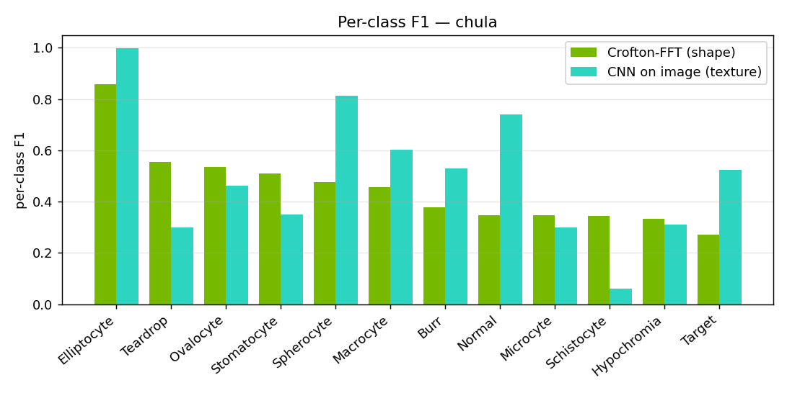
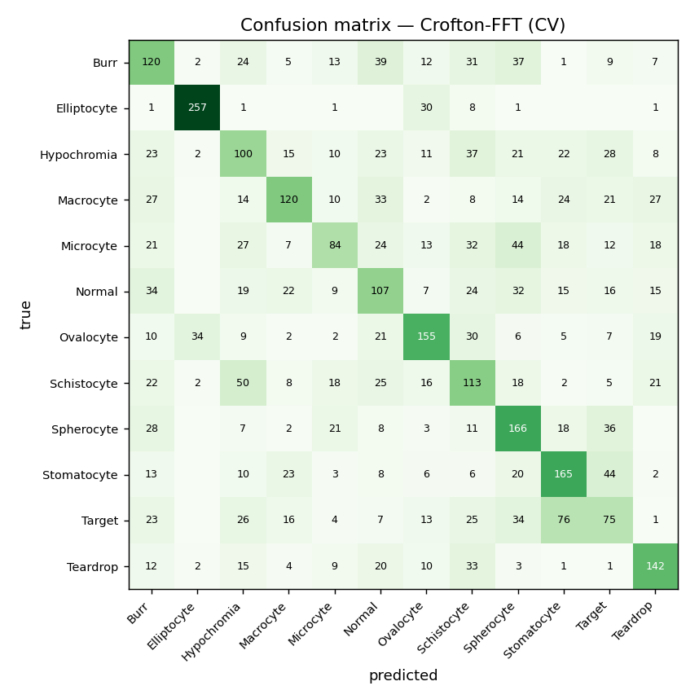
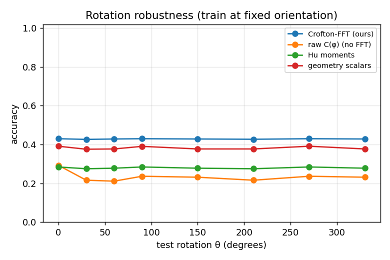

# Crofton-FFT cell classification — results (chula)

Dataset: `datasets/Chula-RBC-12-Dataset` — 3552 cells, 12 classes: ['Burr', 'Elliptocyte', 'Hypochromia', 'Macrocyte', 'Microcyte', 'Normal', 'Ovalocyte', 'Schistocyte', 'Spherocyte', 'Stomatocyte', 'Target', 'Teardrop'].
Classifier: RandomForest (300 trees, balanced) for the feature sets; a small CNN for the image baseline. 5-fold stratified CV.

## Feature-set comparison

| method | #dims / params | accuracy | macro-F1 |
|---|---:|---:|---:|
| Crofton-FFT (ours) | 23 dims | 0.452 | 0.451 |
| geometry scalars | 12 dims | 0.422 | 0.420 |
| Hu moments | 7 dims | 0.290 | 0.282 |
| raw C(φ) (no FFT) | 180 dims | 0.296 | 0.280 |
| CNN on image (texture) | 24588 params | 0.526 | 0.499 |

Best overall: **CNN on image (texture)**. Best interpretable shape-only: **Crofton-FFT (ours)** (acc 0.452).

## Per-class F1 — where shape suffices vs where texture is needed



Per-class report (Crofton-FFT, ours):

```
              precision    recall  f1-score   support

        Burr      0.359     0.400     0.379       300
 Elliptocyte      0.860     0.857     0.858       300
 Hypochromia      0.331     0.333     0.332       300
   Macrocyte      0.536     0.400     0.458       300
   Microcyte      0.457     0.280     0.347       300
      Normal      0.340     0.357     0.348       300
   Ovalocyte      0.558     0.517     0.536       300
 Schistocyte      0.316     0.377     0.343       300
  Spherocyte      0.419     0.553     0.477       300
 Stomatocyte      0.476     0.550     0.510       300
      Target      0.295     0.250     0.271       300
    Teardrop      0.544     0.563     0.554       252

    accuracy                          0.452      3552
   macro avg      0.457     0.453     0.451      3552
weighted avg      0.456     0.452     0.450      3552
```

## Confusion matrix (Crofton-FFT)



## Rotation robustness

Train at a fixed orientation, then rotate every test cell by θ. Invariant descriptors stay flat; non-invariant ones degrade.

| method | spread (max−min) | mean acc |
|---|---:|---:|
| Crofton-FFT (ours) | 0.004 | 0.429 |
| raw C(φ) (no FFT) | 0.082 | 0.234 |
| Hu moments | 0.009 | 0.280 |
| geometry scalars | 0.015 | 0.382 |



## Conclusion

On this 12-class set the CNN-on-image wins overall (F1 0.499 vs 0.451) because many classes are defined by SIZE (macrocyte/microcyte), interior pallor (hypochromia, target) or volume (spherocyte/stomatocyte) — features a scale-invariant *shape* descriptor cannot see. But Crofton-FFT (a) beats every other shape baseline (Hu, raw signature), (b) dominates the purely shape-defined classes (see per-class F1), (c) is rotation-invariant by construction (rotation spread 0.004 vs the CNN's augmentation dependence), and (d) uses 23 interpretable dims vs the CNN's 24,588 opaque parameters.
