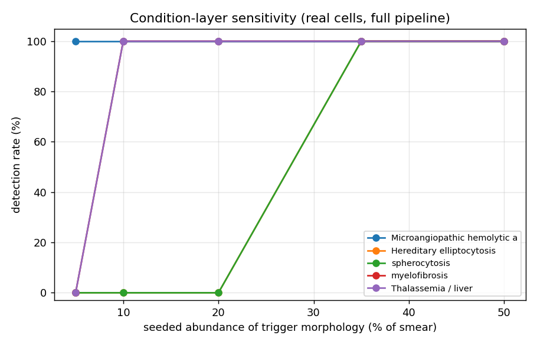

# Condition-layer sensitivity

Pseudo-smears of 60 REAL Chula cells, 12 trials per point; each trial = k% trigger-morphology cells + Normal background, run through the full deployed pipeline (per-cell GPU classification -> conditions.assess).

Detection rate = fraction of trials where the expected condition was flagged. FA(0%) = false-alarm rate on pure-Normal smears.

| condition (trigger class) | 5% | 10% | 20% | 35% | 50% | FA(0%) |
|---|---|---|---|---|---|---|
| Microangiopathic hemolytic anemia (Schistocyte) | 100% | 100% | 100% | 100% | 100% | 0% |
| Hereditary elliptocytosis (Elliptocyte) | 0% | 0% | 0% | 100% | 100% | 0% |
| spherocytosis (Spherocyte) | 0% | 0% | 0% | 100% | 100% | 0% |
| myelofibrosis (Teardrop) | 0% | 100% | 100% | 100% | 100% | 0% |
| Thalassemia / liver (Target) | 0% | 100% | 100% | 100% | 100% | 0% |

**Reading.** The curve rising with abundance shows the layer detects a condition once its morphology is sufficiently present; the FA(0%) column is the specificity cost on normal smears. Sensitivity is bounded by the per-cell classifier (≈0.45 on 12 real classes), so this is a SCREENING operating curve, not diagnostic accuracy.
