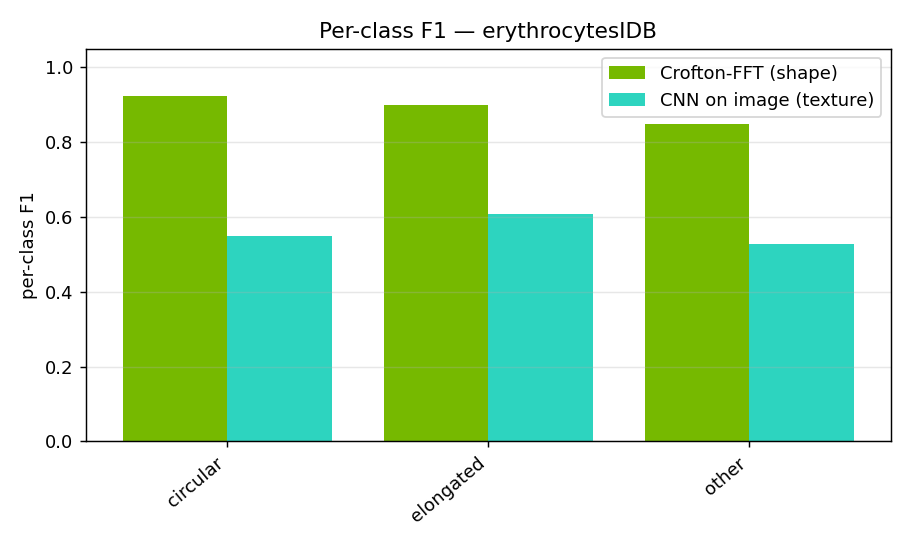
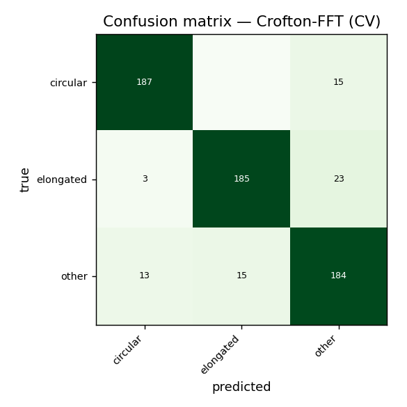
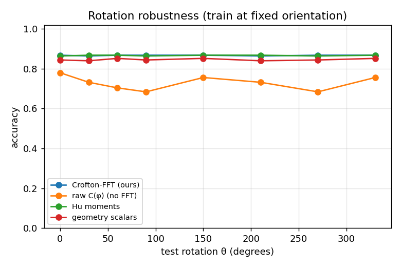

# Crofton-FFT cell classification — results (erythrocytesIDB)

Dataset: `datasets/erythrocytesIDB/Version 2, erythrocytesIDB/erythrocytesIDB1` — 625 cells, 3 classes: ['circular', 'elongated', 'other'].
Classifier: RandomForest (300 trees, balanced) for the feature sets; a small CNN for the image baseline. 5-fold stratified CV.

## Feature-set comparison

| method | #dims / params | accuracy | macro-F1 |
|---|---:|---:|---:|
| Crofton-FFT (ours) | 23 dims | 0.890 | 0.891 |
| geometry scalars | 12 dims | 0.866 | 0.867 |
| Hu moments | 7 dims | 0.858 | 0.859 |
| raw C(φ) (no FFT) | 180 dims | 0.790 | 0.791 |
| CNN on image (texture) | 24003 params | 0.562 | 0.561 |

Best overall: **Crofton-FFT (ours)**. Best interpretable shape-only: **Crofton-FFT (ours)** (acc 0.890).

## Per-class F1 — where shape suffices vs where texture is needed



Per-class report (Crofton-FFT, ours):

```
              precision    recall  f1-score   support

    circular      0.921     0.926     0.923       202
   elongated      0.925     0.877     0.900       211
       other      0.829     0.868     0.848       212

    accuracy                          0.890       625
   macro avg      0.892     0.890     0.891       625
weighted avg      0.891     0.890     0.890       625
```

## Confusion matrix (Crofton-FFT)



## Rotation robustness

Train at a fixed orientation, then rotate every test cell by θ. Invariant descriptors stay flat; non-invariant ones degrade.

| method | spread (max−min) | mean acc |
|---|---:|---:|
| Crofton-FFT (ours) | 0.004 | 0.867 |
| raw C(φ) (no FFT) | 0.096 | 0.728 |
| Hu moments | 0.004 | 0.867 |
| geometry scalars | 0.012 | 0.846 |



## Conclusion

Crofton-FFT is the best method here (F1 0.891), beating the Hu-moment and raw-signature baselines, while being rotation-invariant by construction (rotation spread 0.004) and fully interpretable.
